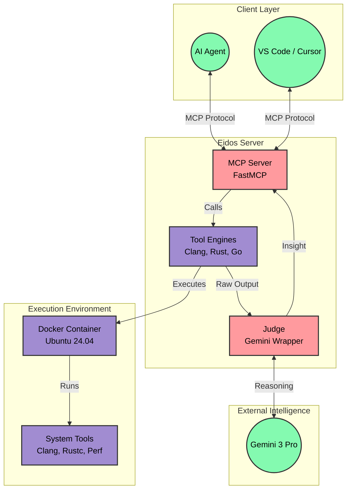

# Eidos: The Agentic Ground Truth Engine

> **Copyright © 2025 Pundarikaksh N Tripathi**  
> This project is licensed under the CC BY-NC-ND 4.0 license. See the [LICENSE](LICENSE) file for details.


## 📖 Introduction

**Eidos** (Greek for *Form/Essence*) is a production-grade **Agentic MCP Server** that serves as a "Ground Truth Engine" for AI Coding Agents. Unlike standard MCP servers that are passive command runners, Eidos is **Agentic**.

It employs the **"Double-Loop" Pattern**:
1.  **Execution:** Runs low-level system tools (Compilers, Debuggers, Profilers) in a sandboxed Docker container.
2.  **Reasoning:** Internally calls **Gemini 3 Pro** to analyze the raw output.
3.  **Synthesis:** Returns high-level engineering insight, not just raw logs.

---

## 📑 Table of Contents

- [📖 Introduction](#-introduction)
- [💡 Solution & How It Works](#-solution--how-it-works)
- [🏗️ Architecture](#-architecture)
- [🛠️ Tech Stack & Engineering Decisions](#-tech-stack--engineering-decisions)
- [📂 Directory Structure](#-directory-structure)
- [🚀 Quick Start](#-quick-start)
- [🐳 Docker Deployment](#-docker-deployment)
- [📚 Core Components](#-core-components)
- [❓ Troubleshooting](#-troubleshooting)
- [🤝 Contributing](#-contributing)
- [📄 License](#-license)

---

## 💡 Solution & How It Works




---

## 🛠️ Tech Stack & Engineering Decisions

| Component | Technology | Reasoning |
|-----------|------------|-----------|
| **Runtime** | **Python 3.14** | Using the free-threaded build for true parallelism in async tasks. |
| **Framework** | **mcp[fastmcp]** | The official Model Context Protocol SDK for building high-performance servers. |
| **Reasoning** | **Gemini 3 Pro** | Chosen for its massive context window (2M tokens) and superior reasoning in code analysis. |
| **Container** | **Docker** | Ensures reproducible builds and safe execution of untrusted code (sanitizers, compilers). |
| **Cloud** | **Blaxel** | Serverless container deployment for instant scaling and low latency. |
| **Package Mgr** | **uv** | Extremely fast Python package installer and resolver, replacing pip/poetry. |

---

## 📂 Directory Structure

```text
Eidos/
├── Dockerfile              # The "Machine": Ubuntu + Clang + Rust + Go
├── blaxel.toml             # Deployment Config
├── pyproject.toml          # Dependencies (mcp, google-genai, python-dotenv)
├── .env                    # Local Secrets (GitIgnored)
├── .env.example            # Template for other devs
├── README.md               # Documentation
└── src/
    ├── server.py           # Main Entry Point & Tool Definitions
    ├── config.py           # Env Vars & Settings loader
    ├── judge.py            # Gemini 3 Pro Wrapper (The "Brain")
    ├── engines/            # Tool Logic (The "Muscle")
    │   ├── clang_engine.py
    │   ├── rust_engine.py
    │   └── go_engine.py
    └── utils/
        └── security.py     # Input sanitization
```

---

## 🚀 Quick Start

### Prerequisites

1.  **[uv](https://github.com/astral-sh/uv)** installed.
2.  **Docker** installed and running.
3.  **Google Gemini API Key** from [Google AI Studio](https://aistudio.google.com/app/apikey).

### Installation

1.  **Clone the repository**:
    ```bash
    git clone https://github.com/PundarikakshNTripathi/Eidos.git
    cd Eidos
    ```

2.  **Install dependencies**:
    ```bash
    uv sync
    ```

3.  **Set up environment variables**:
    ```bash
    cp .env.example .env
    ```
    Edit `.env` and add your `GEMINI_API_KEY`.

### Running Locally

```bash
uv run src/server.py
```
*Note: This runs the server on stdio, which is meant for MCP clients. To test manually, use the MCP Inspector.*

---

## 🐳 Docker Deployment

To run Eidos in a production-like environment:

### Building the Image

```bash
docker build -t eidos .
```

### Running the Container

**Option 1: Pass Key Directly**
```bash
docker run -i -e GEMINI_API_KEY=your_key_here eidos
```

**Option 2: Use .env File (Recommended)**
```bash
docker run -i --env-file .env eidos
```

*Note: The command will appear to "hang". This is normal. It is waiting for JSON-RPC input via Stdio. Do not type in this terminal.*

---

## 🕵️ Testing with MCP Inspector

To test the server interactively, you need to run the **MCP Inspector** in a **separate terminal**.

1.  **Install Inspector**:
    ```bash
    npm install -g @modelcontextprotocol/inspector
    ```

2.  **Run Inspector (Local Mode)**:
    ```bash
    npx @modelcontextprotocol/inspector uv run src/server.py
    ```

3.  **Run Inspector (Docker Mode)**:
2.  Create a feature branch.
3.  Commit your changes.
4.  Push to the branch.
5.  Open a Pull Request.

---

## 📄 License

This project is distributed under the **Creative Commons Attribution-NonCommercial-NoDerivatives 4.0 International** license.

**What this means:**
- ✅ You can view and use this code for learning
- ✅ You can share this project with attribution
- ❌ You cannot use this commercially
- ❌ You cannot create modified versions

See [LICENSE](LICENSE) for the full legal text.
